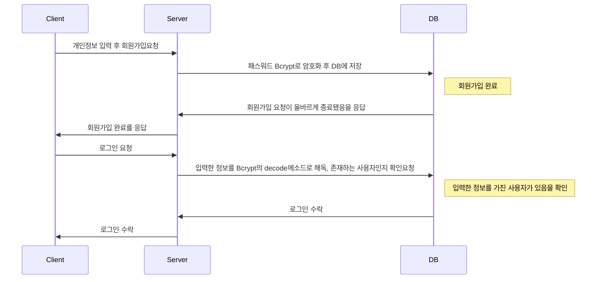
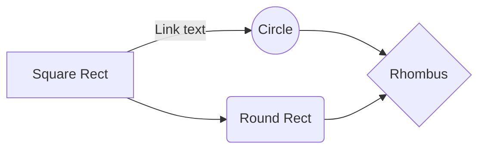

본 프로젝트는 [riot API](https://developer.riotgames.com/)를 활용한 [League Of Legends](https://www.leagueoflegends.com/) 게임의 전적 검색 웹 페이지 입니다.
**Node.js**와 **데이터베이스**를 활용한 첫 프로젝트 이기에, 전적 검색 외에도 **Node.js**와 **데이터베이스**를 상호 활용한 기능을 최대한 많이 구현해보았습니다.

**League of Legends**는 전세계에서 가장 많은 사람들이 즐기는 게임이라고 해도 과언이 아닙니다.
때문에, 이 게임의 각종 통계치를 보여주는 전적 검색사이트들이 실제로 많이 서비스되고있습니다.
우리 주위에서 친숙한 소재이기도 하고 참고할 만한 사이트들도 많다는 것을 이유로들어, 첫 번째 프로젝트 주제로 삼게되었습니다.

페이지 URL : https://golden-chimera-76d804.netlify.app/

# :sunglasses: 주요 기능
**League Of Legends**[[1]](#footnote_1) 게임의 유저 전적 검색 사이트인 만큼 전적 검색 기능이 가장 주요한 기능입니다.
**Riot**[[2]](#footnote_2)에서 제공하는 API를 실시간으로 받아와 검색한 유저의 최근 게임 전적을 보여주고, 각 게임 전적의 간단한 정보를 제공합니다. 더 자세한 것은 아래에 기술합니다.

요즘 웹 페이지를 이용할 때, 사용자들 간 의견 공유를 위한 커뮤니티 기능이 빠질 수 없습니다. 
가장 먼저, 커뮤니티 공간에서 소통을 하기 위한 로그인, 회원가입 등의 기능을 구현했습니다.
사용자간 커뮤니티 기능을 하는 게시판 페이지도 구현하였습니다. 글을 작성하고, 댓글을 남기고, 좋아요를 누르는 등의 간단한 상호작용을 배치하였습니다.

기본적으로, **League of Legends**게임과 관련된 웹 페이지이기 때문에, Riot API에서 제공하는 
**League of Lengends**에서 등장하는 캐릭터들의 기본정보들을 모아놓은 '챔피언 정보' 페이지도 구현했습니다.

# :book: 기술스택
 

  
<h3>언어, 플랫폼<h3/>

   
  
 
 
  
  <h3>도구<h3/>
  
  
  
  
  

# 실행환경
프로젝트 제작과 실행은 2인이서 진행하였는데, 모두 윈도우 OS환경에서 실행했습니다.

Client 부분은 JavaScript의 라이브러리[[3]](#footnote_3)인 React환경에서 개발, 실행했습니다.
배포는 무료로 사용가능한 Netlify에서 진행했습니다.

Server 부분은 자바스크립트 RunTime인 Node.js와 그의 프레임워크인 Express로 개발, 실행했습니다.
배포는 AWS의 FreeTier 기간을 이용해 AWS로 배포했습니다.

데이터베이스는 No SQL 데이터베이스인 MongoDB를 사용했습니다.

# 페이지 작동 방식

Arcane 페이지의 작동방식은 Client, Server, DB간의 상호작용으로 이루어져있습니다.

### 로그인,회원가입 Process

And this will produce a flow chart:

# 파일

The file explorer is accessible using the button in left corner of the navigation bar. You can create a new file by clicking the **New file** button in the file explorer. You can also create folders by clicking the **New folder** button.

## SmartyPants

SmartyPants converts ASCII punctuation characters into "smart" typographic punctuation HTML entities. For example:

|                |ASCII                          |HTML                         |
|----------------|-------------------------------|-----------------------------|
|Single backticks|`'Isn't this fun?'`            |'Isn't this fun?'            |
|Quotes          |`"Isn't this fun?"`            |"Isn't this fun?"            |
|Dashes          |`-- is en-dash, --- is em-dash`|-- is en-dash, --- is em-dash|

## KaTeX

You can render LaTeX mathematical expressions using [KaTeX](https://khan.github.io/KaTeX/):

The *Gamma function* satisfying $\Gamma(n) = (n-1)!\quad\forall n\in\mathbb N$ is via the Euler integral

$$
\Gamma(z) = \int_0^\infty t^{z-1}e^{-t}dt\,.
$$

> You can find more information about **LaTeX** mathematical expressions [here](http://meta.math.stackexchange.com/questions/5020/mathjax-basic-tutorial-and-quick-reference).

 
<a name="footnote_1">[1]</a> 《리그 오브 레전드》는 라이엇 게임즈에서 개발 및 서비스하는 멀티플레이어 온라인 배틀 아레나 비디오 게임이다.
 
<a name="footnote_2">[2]</a> 라이엇 게임즈(Riot Games)는 미국의 게임 개발 회사이다. 캘리포니아주 산타 모니카에 본사를 두고 있다. 2008년 10월 첫 개발작 '리그 오브 레전드: 운명의 충돌'을 발표했고 2009년 10월에 '리그 오브 레전드'라는 이름으로 게임을 발매한 이후 운영하고 있다.
 
<a name="footnote_3">[3]</a> React는 프레임워크가 아니라 라이브러리이다.
